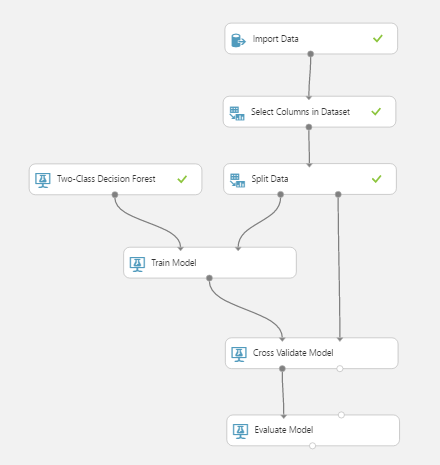
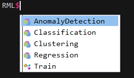
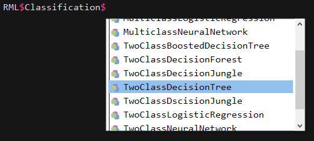
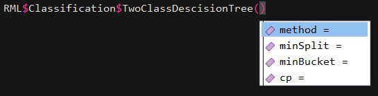

# RML
R Machine Learning Framework - A simpler way to do machine learning in R. 

# About
Inspired by Microsoft's Azure Machine Learning, this is an attempt to provide a simple, clean workflow for rapid prototyping in R. 

 

These steps are replicated in RML as follows:

1. Import Data and Select Columns - `dataSet <- iris`
2. Split Data - `Coming Soon`
3. Select Model - `model <- RML$Classification$TwoClassDescisionTree()`
4. Train Model - `trainModel <- RML$Train$TrainModel(model, dataSet, dataSet$Species)`
5. Evaluate Model - `summary(trainModel)` automated evaluation to come.

# Why do we need a framework?
Training models in R can be a messy business. Simple tasks like importing a dataset, splitting it into training and test sets and passing it to a model can result in many extra and often cryptic lines of code. 

When comparing models it's often easy to forget the different packages we used, what their syntax looked like and what stucture your data should be in. 

RML seeks to cut through some of this noise by providing a well defined workflow, common utility methods and grouped models with clean, uniform APIs.

The result should be a rapid prototyping environment that will increase team colaboration, encourage cleaner more reusable code and ultimately free up our time to solve more problems. 

# Name Space
The RML Names Space will be grouped by functionality so as to guide you through the process of building and tuning models as much as possible. 

 
 
 

# Examples
Current workflow (got a long way to go)

## Linear Regression
A simple linear regression using lm. This is supported primarily to match Microsoft Azure ML's functionality. 

### Basic 
```
source("./RML/rml.R", chdir = TRUE)

dataSet <- iris
model <- RML$Regression$LinearRegression()
trainModel <- RML$Train$TrainModel(model, dataSet, dataSet$Sepal.Length)
```

### Advanced
Here it is best to use the lm syntax correctly. 

## Two Class Descision Tree
Using the rpart package.

### Basic
Assumes a set of default parameters.

* method = auto
* min split = 30
* min bucket = 0
* cp = 0.001

```
source("./RML/rml.R", chdir = TRUE)

dataSet <- iris
model <- RML$Classification$TwoClassDescisionTree()
trainModel <- RML$Train$TrainModel(model, dataSet, dataSet$Species)
```

### Advanced
Custom parameters can be set and tuned explicitly. 

```
source("./RML/rml.R", chdir = TRUE)

dataSet <- iris
model <- RML$Classification$TwoClassDescisionTree(method='anova', minSplit='10', minBucket='5', cp=0.02)
trainModel <- RML$Train$TrainModel(model, dataSet, dataSet$Species)
```

# TODO

## General
* Method for splitting data on ratio 7/10 etc
* Method for comparing like models

## Training Methods
* Auto tuning of Hyperparameters

## Models to be supported 
* Anomaly Detection
    * One-Class Support Vector Machine
    * PCA-Based Anomaly Detection
* Classification
    * Multiclass
        * Decision Forest
        * Decision Jungle
        * Logistic Regression
        * Neural Network
    * Two-Class
        * Boosted Decision Tree
        * Decision Forest
        * Dscision Jungle
        * Logistic Regression
        * Neural Network
        * Support Vector Machine
* Clustering
    * K-Means
* Regression
    * Bayesian Linear Regression
    * Boosted Decision Tree Regression
    * Decision Forest Regression
    * Fast Forst Quantile Regression
    * Neural Network Regression
    * Ordinal Regression
    * Poisson Regression